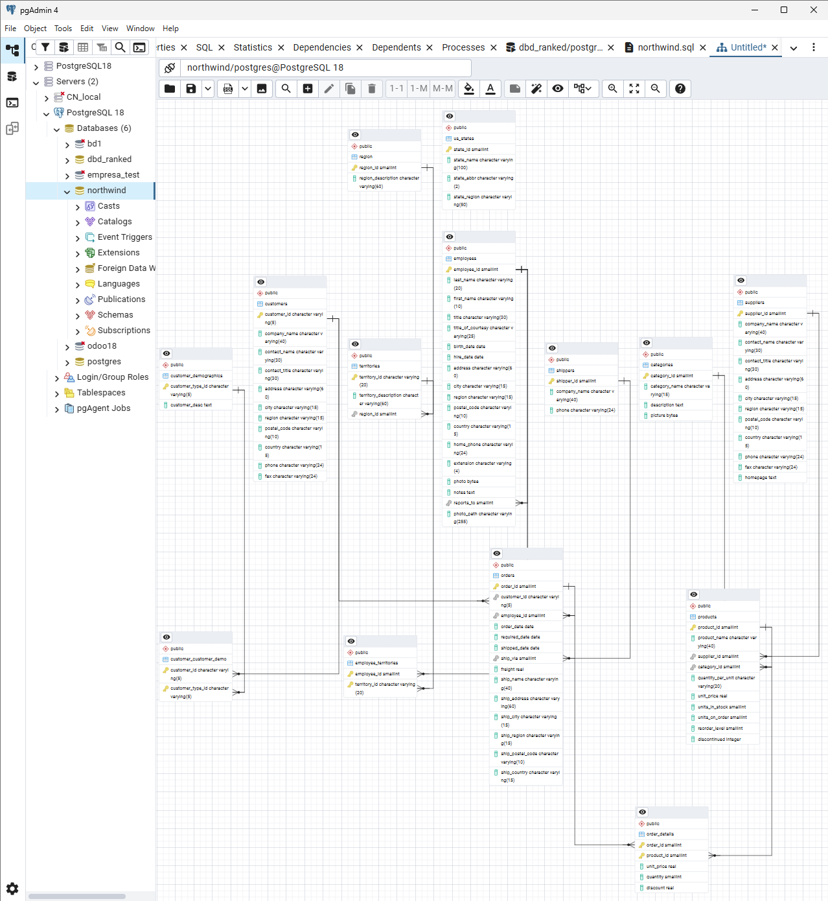

# Práctica 02 — Modelo SQL Northwind

**Autor:** _(tu nombre completo)_

**Versiones utilizadas:**
- PostgreSQL: _(completa la versión, ejecuta `SELECT version();`)_
- pgAdmin: 4 (versión _(completa la que te aparece en Help → About)_)

## Cómo reproducir este trabajo

1. Instala PostgreSQL y pgAdmin 4 siguiendo la guía de la Parte 1 de la práctica.
2. Crea la base de datos forzando codificación UTF-8:
   ```sql
   CREATE DATABASE northwind
       WITH ENCODING  = 'UTF8'
            TEMPLATE  = template0;
   ```
3. Selecciona la base `northwind` en el árbol de pgAdmin y ejecuta el script `northwind.sql` desde el Query Tool (Tools → Query Tool → abrir fichero → F5).
4. Verifica la carga:
   ```sql
   SELECT (SELECT count(*) FROM customers) AS clientes,
          (SELECT count(*) FROM orders) AS pedidos,
          (SELECT count(*) FROM order_details) AS lineas,
          (SELECT count(*) FROM products) AS productos,
          (SELECT count(*) FROM employees) AS empleados,
          (SELECT count(*) FROM suppliers) AS proveedores;
   ```
   Debe devolver 91 / 830 / 2155 / 77 / 9 / 29.

## Diagrama entidad-relación



## Índice de consultas

Todas las consultas, sus resultados y los comentarios están en [`respuestas.md`](respuestas.md).

| # | Pregunta |
|---|----------|
| 1 | Catálogo comercial activo |
| 2 | Concentración geográfica de la cartera |
| 3 | Alerta de reposición |
| 4 | Ficha completa de producto |
| 5 | Detalle valorizado de un pedido |
| 6 | Ranking de categorías por facturación |
| 7 | Clientes sin actividad comercial |
| 8 | Organigrama de la fuerza de ventas |
| 9 | Rejilla de cobertura categoría × año |
| 10 | Mapa de países: clientes frente a proveedores |
| 11 | Directorio unificado de contactos |
| 12 | Mercados con desequilibrio |
| 13 | Clientes que nunca han comprado pescado |
| 14 | Productos por encima de la media |
| 15 | Ticket medio por cliente |
| 16 | El producto más caro de cada categoría |
| 17 | Segmentación ABC de la cartera de clientes |
| 18 | Los tres productos más vendidos de cada categoría |
| 19 | Evolución mensual con acumulado y media móvil |
| 20 | Cuadro de mando anual por categoría |
