# Respuestas — Práctica 02: Northwind SQL

## Pregunta 1 — Catálogo comercial activo

**Enunciado:** Productos no descatalogados con precio entre 10 y 50 €, ordenados de mayor a menor precio.

**Consulta:**

```sql
-- EJ 1
SELECT product_name           AS producto,
       ROUND(unit_price::numeric, 2) AS precio
FROM products
WHERE discontinued = 0
  AND unit_price BETWEEN 10 AND 50
ORDER BY precio DESC;
```

**Resultado:**

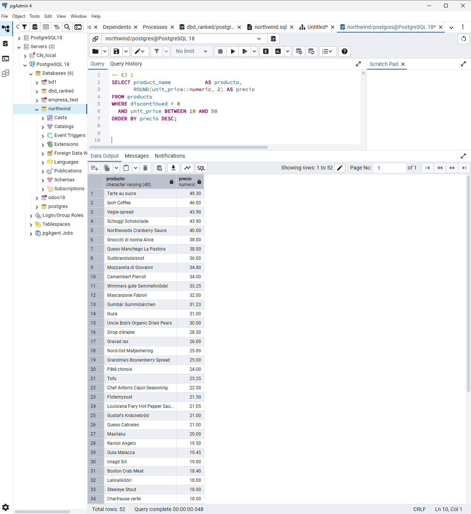

**Comentario:** Al principio pensé que `discontinued` sería un booleano y probé con `NOT discontinued`, pero da error porque en realidad es un `integer`. Comprobé el tipo de columna en pgAdmin (panel de columnas) y ahí vi que 0 es activo y 1 descatalogado. Usé BETWEEN porque es más corto que poner dos condiciones con AND.

---

## Pregunta 2 — Concentración geográfica de la cartera

**Enunciado:** Países con 5 o más clientes, con número de ciudades distintas.

**Consulta:**

```sql
-- EJ 2
SELECT country               AS pais,
       COUNT(*)              AS num_clientes,
       COUNT(DISTINCT city)  AS num_ciudades
FROM customers
GROUP BY country
HAVING COUNT(*) >= 5
ORDER BY num_clientes DESC;
```

**Resultado:**

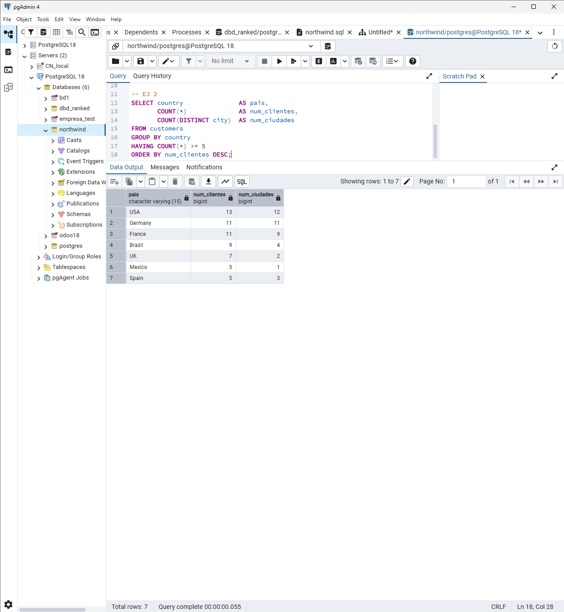

**Comentario:** Aquí no se puede usar WHERE porque la condición depende de un COUNT, y WHERE se aplica antes de agrupar, cuando ese conteo todavía no existe. Con HAVING el filtro se aplica después del GROUP BY, que es cuando ya tenemos el número de clientes por país.

---

## Pregunta 3 — Alerta de reposición

**Enunciado:** Productos activos en riesgo de rotura de stock.

**Consulta:**

```sql
-- EJ 3
SELECT product_name    AS producto,
       units_in_stock  AS stock,
       reorder_level   AS nivel_reposicion,
       units_on_order  AS pedido_a_proveedor,
       CASE WHEN units_in_stock = 0 THEN 'CRÍTICO' ELSE 'AVISO' END AS situacion
FROM products
WHERE discontinued = 0
  AND units_in_stock IS NOT NULL
  AND reorder_level IS NOT NULL
  AND units_in_stock <= reorder_level
ORDER BY stock;
```

**Resultado:**

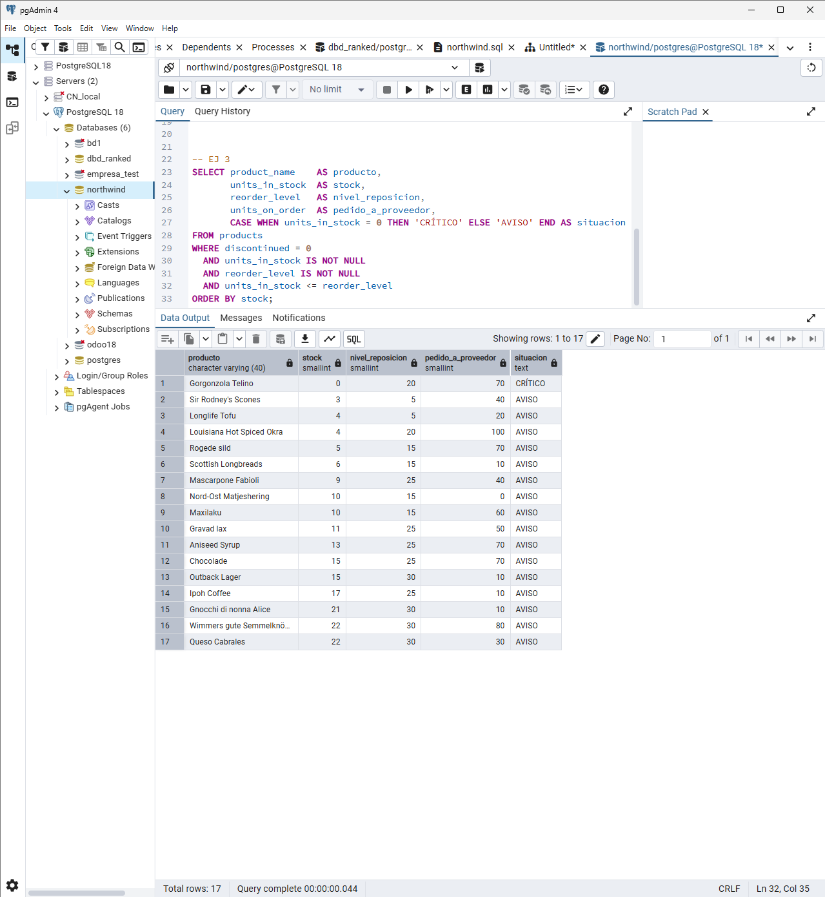

**Comentario:** Si no pongo el IS NOT NULL en units_in_stock y reorder_level, algunos productos desaparecen del resultado sin dar error, porque una comparación con NULL no es ni verdadera ni falsa. Me di cuenta al comparar el número de filas con y sin ese filtro, salían menos de las que esperaba.

---

## Pregunta 4 — Ficha completa de producto

**Enunciado:** Productos de proveedores de Italia, Francia o España, con su categoría y datos del proveedor.

**Consulta:**

```sql
-- EJ 4
SELECT p.product_name  AS producto,
       cat.category_name AS categoria,
       s.company_name  AS proveedor,
       s.country       AS pais,
       s.city          AS ciudad
FROM products p
INNER JOIN categories cat ON cat.category_id = p.category_id
INNER JOIN suppliers  s   ON s.supplier_id   = p.supplier_id
WHERE s.country IN ('Italy', 'France', 'Spain')
ORDER BY s.country, p.product_name;
```

**Resultado:**

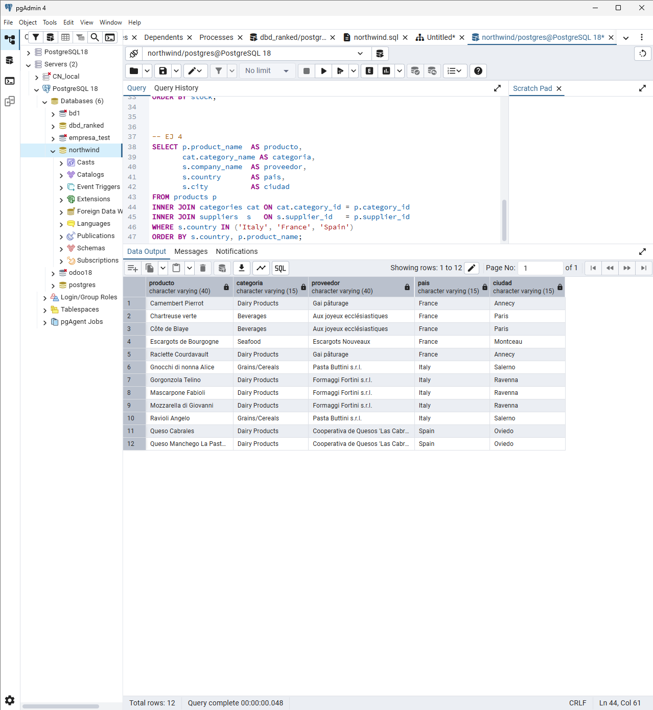

**Comentario:** Tuve que mirar el diagrama ER porque al principio intenté unir products directamente con el país y no hay ninguna relación ahí, el país está en suppliers. Al final quedan 3 tablas unidas con INNER JOIN porque solo quiero productos que sí tengan categoría y proveedor.

---

## Pregunta 5 — Detalle valorizado de un pedido

**Enunciado:** Detalle línea a línea del pedido 10248.

**Consulta:**

```sql
-- EJ 5
SELECT c.company_name   AS cliente,
       o.order_date     AS fecha_pedido,
       p.product_name   AS producto,
       od.unit_price    AS precio_unitario,
       od.quantity      AS cantidad,
       od.discount      AS descuento,
       ROUND((od.unit_price::numeric) * od.quantity * (1 - od.discount::numeric), 2) AS importe_linea
FROM orders o
INNER JOIN customers c USING (customer_id)
INNER JOIN order_details od USING (order_id)
INNER JOIN products p USING (product_id)
WHERE o.order_id = 10248;
```

**Resultado:**

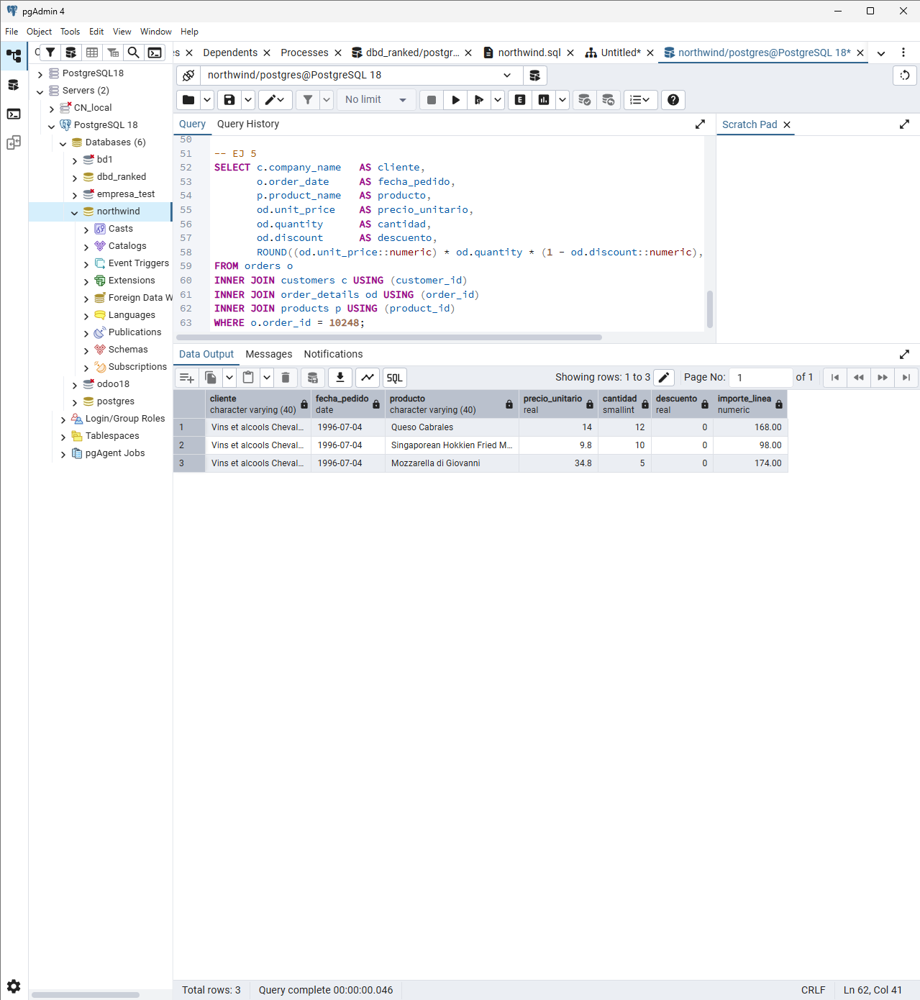

**Comentario:** Usé USING porque order_id y product_id se llaman igual en las dos tablas que uno cada vez, así no tengo que escribir la condición completa con ON y encima no me sale la columna duplicada en el resultado.

---

## Pregunta 6 — Ranking de categorías por facturación

**Enunciado:** Facturación total por categoría, solo las que superan 100.000 €.

**Consulta:**

```sql
-- EJ 6
SELECT cat.category_name                     AS categoria,
       COUNT(od.order_id)                    AS num_lineas,
       COUNT(DISTINCT p.product_id)          AS num_productos,
       ROUND(SUM((od.unit_price::numeric) * od.quantity * (1 - od.discount::numeric)), 2) AS facturacion
FROM categories cat
INNER JOIN products p      ON p.category_id = cat.category_id
INNER JOIN order_details od ON od.product_id = p.product_id
GROUP BY cat.category_name
HAVING SUM((od.unit_price::numeric) * od.quantity * (1 - od.discount::numeric)) > 100000
ORDER BY facturacion DESC;
```

**Resultado:**

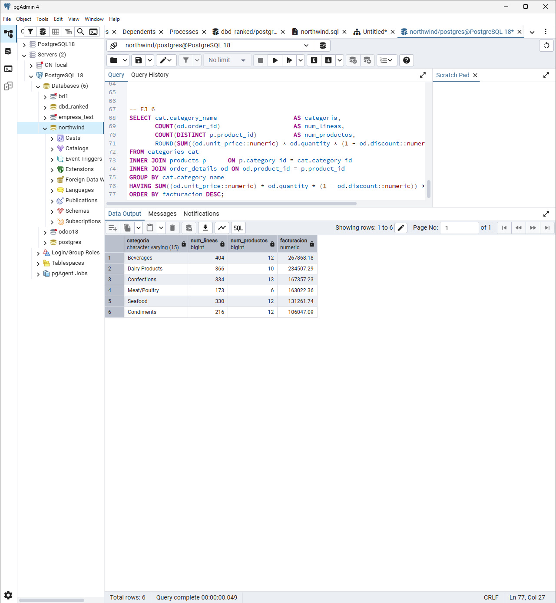

**Comentario:** Aquí repetí la misma expresión de SUM en el HAVING que en el SELECT, no encontré forma de usar el alias directamente en HAVING (en PostgreSQL no funciona). Me sorprendió que solo unas pocas categorías pasen del umbral de 100.000, pensaba que serían más.

---

## Pregunta 7 — Clientes sin actividad comercial

**Enunciado:** Todos los clientes con su número de pedidos, incluidos los que nunca han comprado.

**Consulta:**

```sql
-- EJ 7
SELECT c.company_name AS cliente,
       c.country      AS pais,
       COUNT(o.order_id) AS num_pedidos,
       COALESCE(MAX(o.order_date)::text, 'SIN PEDIDOS') AS ultimo_pedido
FROM customers c
LEFT JOIN orders o ON o.customer_id = c.customer_id
GROUP BY c.company_name, c.country
ORDER BY num_pedidos, cliente;
```

**Resultado:**

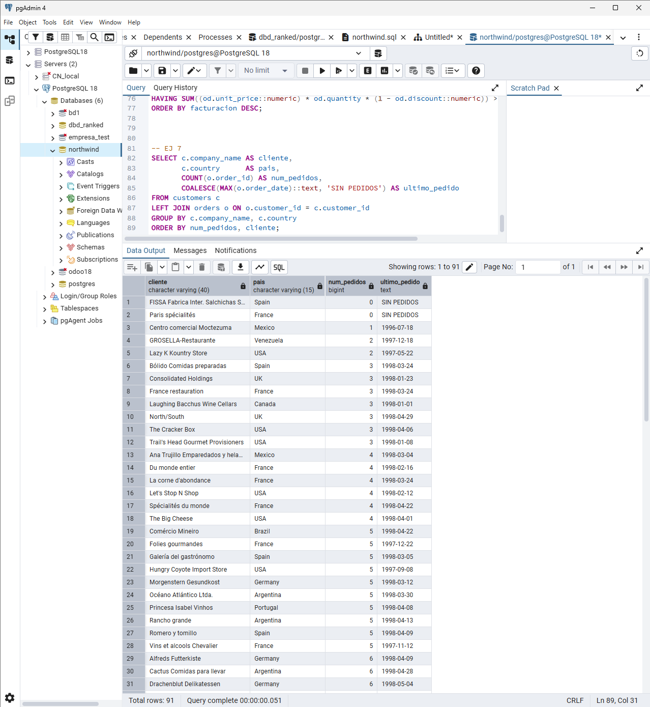

**Comentario:** Si pongo COUNT(*) en vez de COUNT(o.order_id), los clientes sin pedidos salen con un 1 en vez de un 0, porque el LEFT JOIN sí genera una fila para ellos aunque esté rellena de NULL. COUNT(columna) en cambio no cuenta los NULL, así que es la forma correcta de contar pedidos reales.

---

## Pregunta 8 — Organigrama de la fuerza de ventas

**Enunciado:** Cada empleado con su responsable directo (auto-JOIN).

**Consulta:**

```sql
-- EJ 8
SELECT emp.first_name || ' ' || emp.last_name AS empleado,
       emp.title AS cargo,
       COALESCE(jefe.first_name || ' ' || jefe.last_name, 'DIRECCIÓN GENERAL') AS responsable,
       COALESCE(jefe.title, '') AS cargo_responsable
FROM employees emp
LEFT JOIN employees jefe ON jefe.employee_id = emp.reports_to
ORDER BY empleado;
```

**Resultado:**

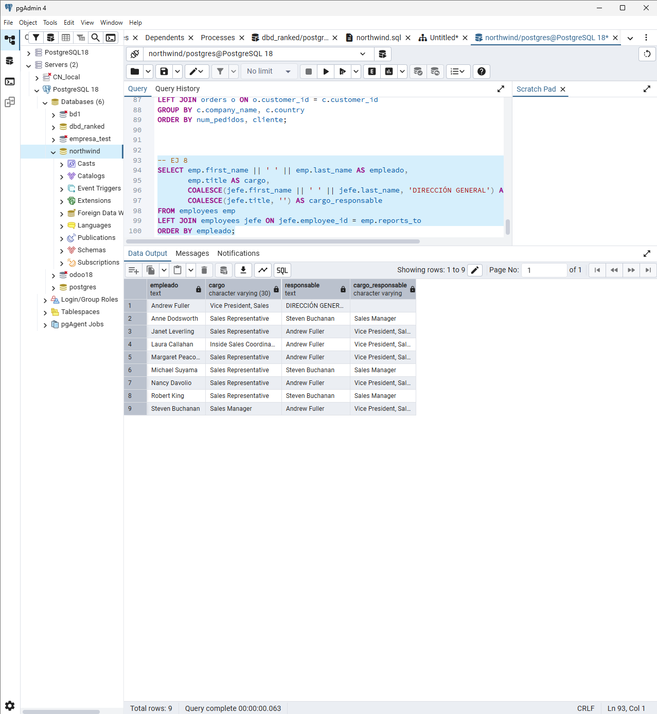

**Comentario:** La parte que más me costó fue entender que employees se une consigo misma, así que hacen falta dos alias distintos (emp y jefe) aunque sea la misma tabla. Usé LEFT JOIN y no INNER porque si no, el empleado que no reporta a nadie desaparecería del resultado.

---

## Pregunta 9 — Rejilla de cobertura categoría × año

**Enunciado:** Facturación por categoría y año, sin huecos (24 filas).

**Consulta:**

```sql
-- EJ 9
WITH categorias AS (
    SELECT category_id, category_name FROM categories
),
anios AS (
    SELECT generate_series(1996, 1998) AS anio
),
grid AS (
    SELECT c.category_id, c.category_name, a.anio
    FROM categorias c
    CROSS JOIN anios a
),
ventas AS (
    SELECT p.category_id,
           EXTRACT(YEAR FROM o.order_date)::int AS anio,
           SUM((od.unit_price::numeric) * od.quantity * (1 - od.discount::numeric)) AS facturacion
    FROM order_details od
    INNER JOIN orders o    ON o.order_id = od.order_id
    INNER JOIN products p  ON p.product_id = od.product_id
    GROUP BY p.category_id, EXTRACT(YEAR FROM o.order_date)
)
SELECT g.category_name AS categoria,
       g.anio,
       ROUND(COALESCE(v.facturacion, 0), 2) AS facturacion
FROM grid g
LEFT JOIN ventas v ON v.category_id = g.category_id AND v.anio = g.anio
ORDER BY categoria, anio;
```

**Resultado:**

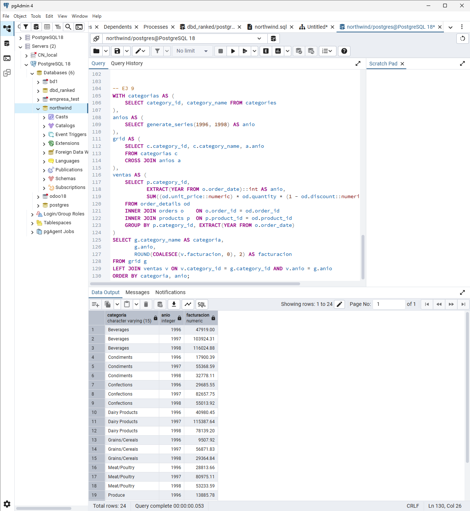

**Comentario:** Primero genero todas las combinaciones posibles de categoría y año con CROSS JOIN (esto me da las 24 filas seguro), y luego le pego los datos reales con LEFT JOIN. Si lo hiciera al revés, agrupando directamente las ventas, las combinaciones sin ventas ese año no aparecerían nunca en el resultado.

---

## Pregunta 10 — Mapa de países: clientes frente a proveedores

**Enunciado:** Clientes y proveedores por país, incluyendo los que solo tienen uno u otro.

**Consulta:**

```sql
-- EJ 10
WITH clientes_pais AS (
    SELECT country AS pais, COUNT(*) AS num_clientes
    FROM customers
    GROUP BY country
),
proveedores_pais AS (
    SELECT country AS pais, COUNT(*) AS num_proveedores
    FROM suppliers
    GROUP BY country
)
SELECT COALESCE(cp.pais, pp.pais) AS pais,
       COALESCE(cp.num_clientes, 0)    AS num_clientes,
       COALESCE(pp.num_proveedores, 0) AS num_proveedores,
       CASE
           WHEN cp.pais IS NOT NULL AND pp.pais IS NOT NULL THEN 'AMBOS'
           WHEN cp.pais IS NOT NULL THEN 'SOLO CLIENTES'
           ELSE 'SOLO PROVEEDORES'
       END AS tipo_presencia
FROM clientes_pais cp
FULL JOIN proveedores_pais pp ON pp.pais = cp.pais
ORDER BY pais;
```

**Resultado:**

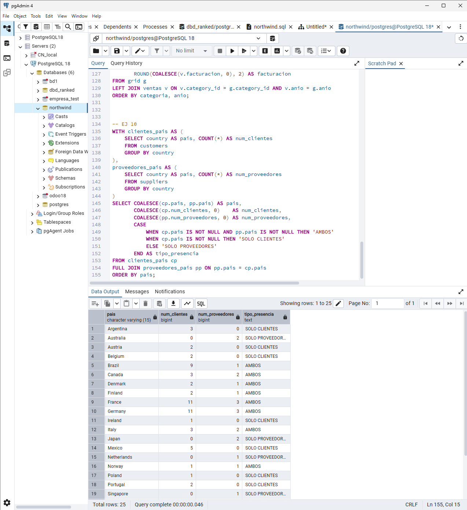

**Comentario:** Si en el SELECT pongo solo cp.pais, los países que solo existen en proveedores saldrían en NULL, porque en un FULL JOIN esa columna puede venir vacía de cualquiera de los dos lados. Con COALESCE cojo el que no sea nulo de los dos.

---

## Pregunta 11 — Directorio unificado de contactos

**Enunciado:** Contactos de clientes, proveedores y empleados en una sola tabla.

**Consulta:**

```sql
-- EJ 11
SELECT 'CLIENTE'   AS origen, UPPER(contact_name) AS contacto, company_name AS organizacion, city AS ciudad, country AS pais
FROM customers
UNION ALL
SELECT 'PROVEEDOR', UPPER(contact_name), company_name, city, country
FROM suppliers
UNION ALL
SELECT 'EMPLEADO', UPPER(first_name || ' ' || last_name), 'NORTHWIND TRADERS', city, country
FROM employees
ORDER BY origen, pais;
```

**Resultado:**

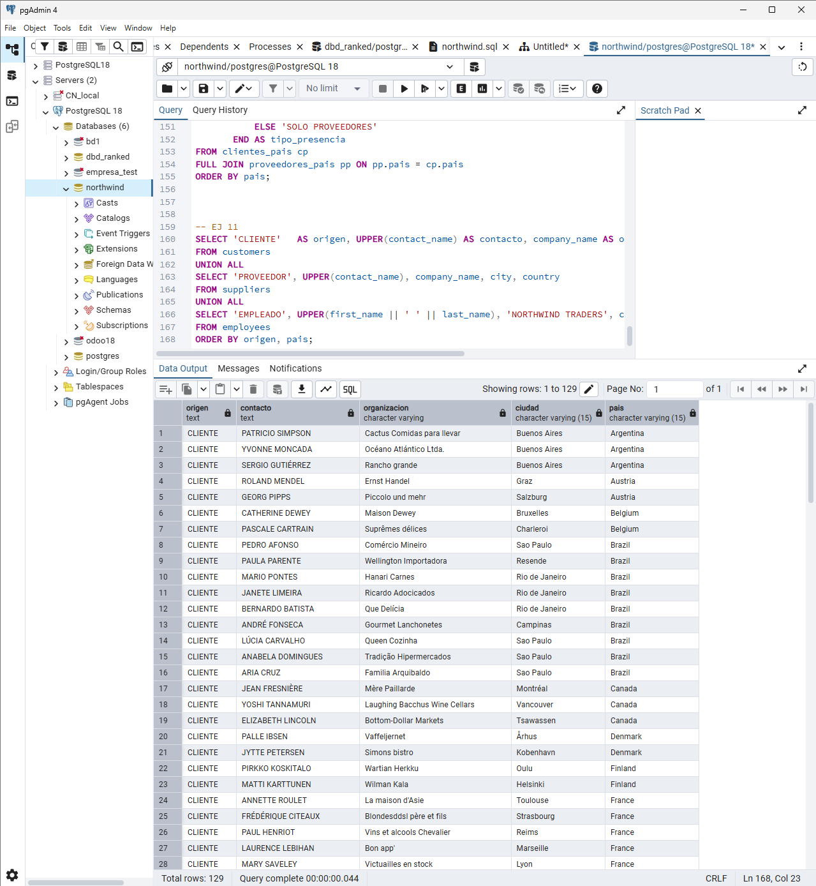

**Comentario:** Usé UNION ALL porque UNION quita filas duplicadas, y aquí no tiene sentido: si un cliente y un proveedor casualmente tuvieran el mismo nombre de contacto y ciudad, UNION los fusionaría en una fila y perderíamos uno de los dos contactos sin darnos cuenta.

---

## Pregunta 12 — Mercados con desequilibrio

**Enunciado:** a) Países con clientes pero sin proveedores. b) Países con ambos.

**Consulta (a):**

```sql
-- EJ 12a
SELECT country AS pais FROM customers
EXCEPT
SELECT country FROM suppliers
ORDER BY pais;
```

**Resultado (a):**

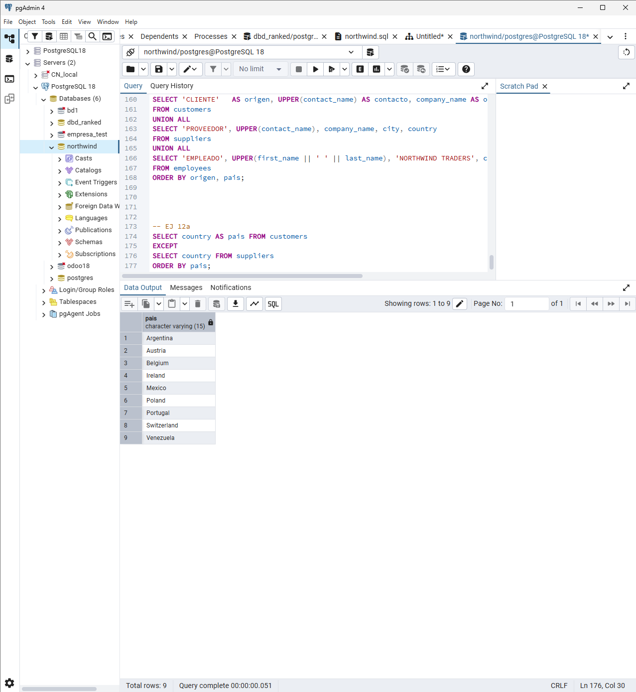

**Consulta (b):**

```sql
-- EJ 12b
SELECT country AS pais FROM customers
INTERSECT
SELECT country FROM suppliers
ORDER BY pais;
```

**Resultado (b):**

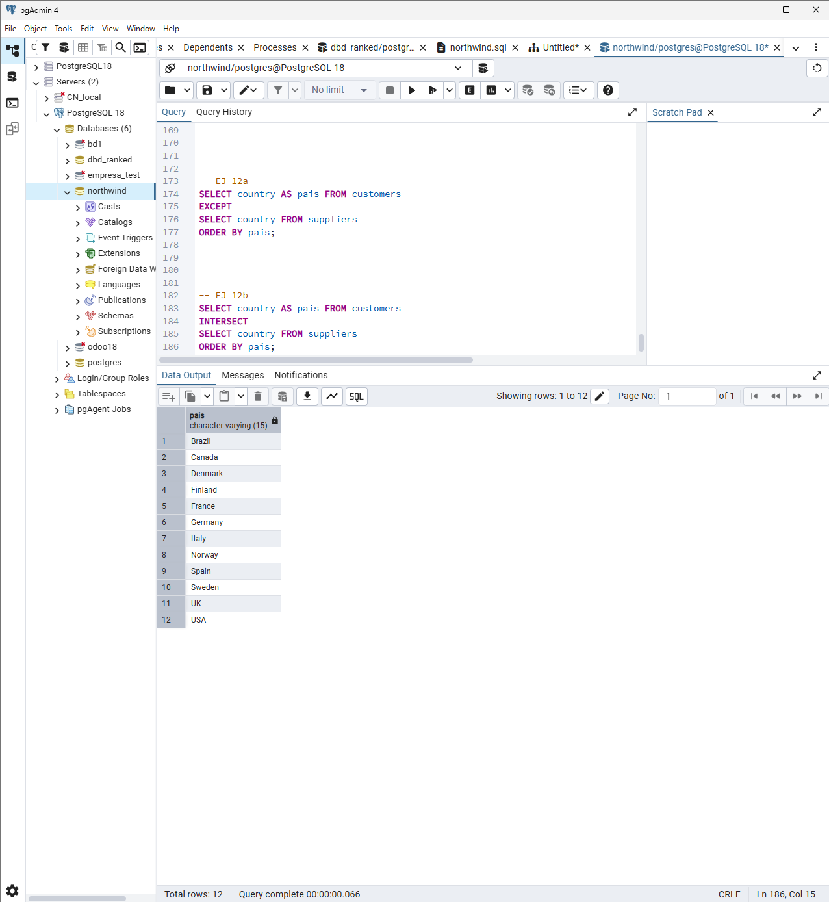

**Comentario:** Con EXCEPT e INTERSECT el código queda mucho más corto que con un LEFT JOIN ... WHERE ... IS NULL, y además estos operadores quitan duplicados automáticamente. Probé también la versión con LEFT JOIN y el resultado es el mismo, solo que hay que acordarse de filtrar por la columna de la derecha siendo NULL para quedarte con los que no tienen proveedor.

---

## Pregunta 13 — Clientes que nunca han comprado pescado

**Enunciado:** Clientes que nunca han incluido un producto de la categoría Seafood.

**Consulta:**

```sql
-- EJ 13
SELECT c.company_name AS cliente,
       c.country      AS pais,
       COUNT(o.order_id) AS pedidos_realizados
FROM customers c
LEFT JOIN orders o ON o.customer_id = c.customer_id
WHERE NOT EXISTS (
    SELECT 1
    FROM orders o2
    INNER JOIN order_details od2 ON od2.order_id = o2.order_id
    INNER JOIN products p2       ON p2.product_id = od2.product_id
    INNER JOIN categories cat2   ON cat2.category_id = p2.category_id
    WHERE o2.customer_id = c.customer_id
      AND cat2.category_name = 'Seafood'
)
GROUP BY c.company_name, c.country
ORDER BY pedidos_realizados DESC;
```

**Resultado:**

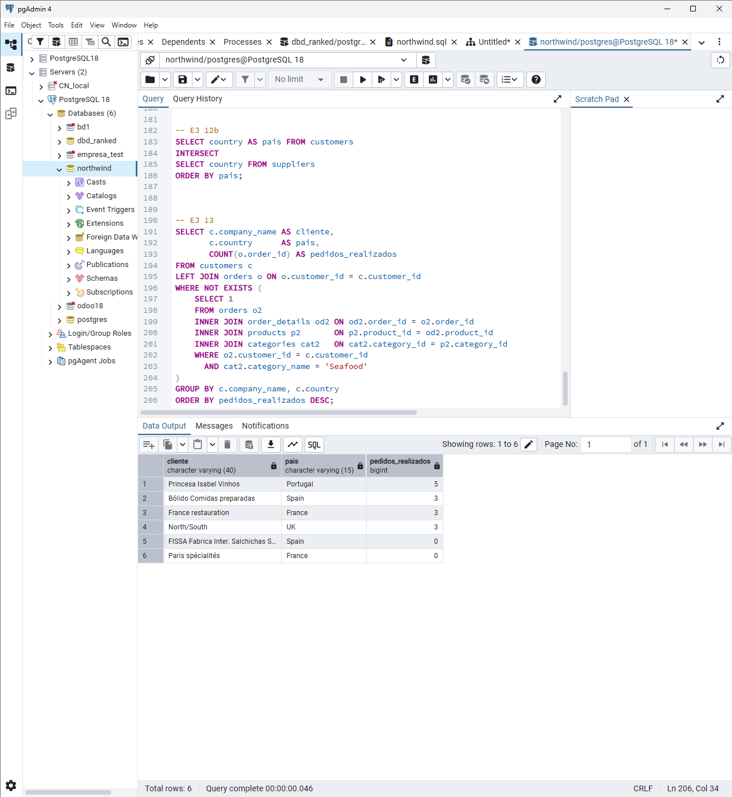

**Comentario:** Probé primero con NOT IN en vez de NOT EXISTS y me salió una tabla completamente vacía, sin ningún error. Al final vi que era porque la subconsulta de NOT IN puede devolver algún NULL y en ese caso todo el NOT IN se vuelve falso para cualquier fila. Con NOT EXISTS no pasa esto, así que me quedé con esa versión.

---

## Pregunta 14 — Productos por encima de la media

**Enunciado:** Productos activos con precio por encima de la media del catálogo.

**Consulta:**

```sql
-- EJ 14
SELECT p.product_name AS producto,
       ROUND(p.unit_price::numeric, 2) AS precio,
       ROUND((SELECT AVG(unit_price::numeric) FROM products), 2) AS precio_medio_catalogo,
       ROUND(p.unit_price::numeric - (SELECT AVG(unit_price::numeric) FROM products), 2) AS diferencia
FROM products p
WHERE p.discontinued = 0
  AND p.unit_price > (SELECT AVG(unit_price::numeric) FROM products)
ORDER BY diferencia DESC;
```

**Resultado:**

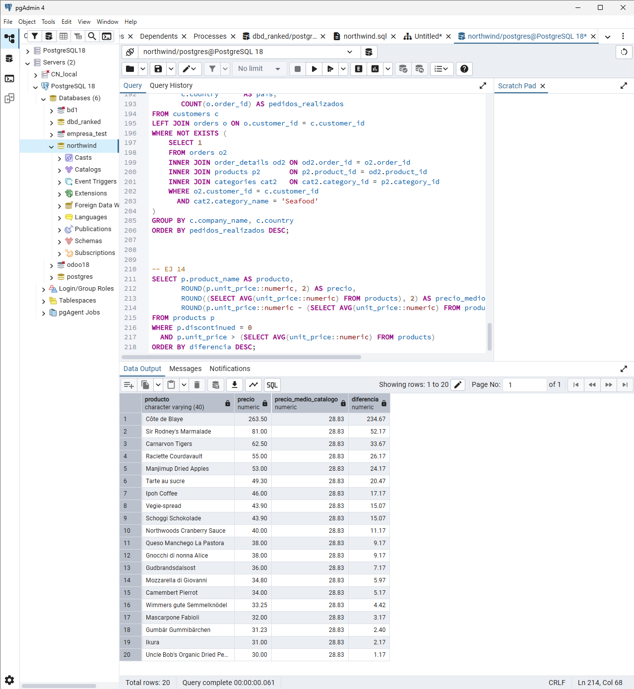

**Comentario:** La subconsulta del precio medio la repetí dos veces, una en el WHERE y otra en el SELECT, porque no encontré forma de reutilizarla sin repetirla ahí mismo. Ya se ve venir que esto se arreglaría con un CTE calculando la media una sola vez, cosa que hago más adelante en la 17.

---

## Pregunta 15 — Ticket medio por cliente

**Enunciado:** Top 15 clientes por ticket medio (importe medio por pedido).

**Consulta:**

```sql
-- EJ 15
SELECT cliente,
       pais,
       COUNT(*)                    AS num_pedidos,
       ROUND(SUM(importe_pedido), 2) AS importe_total,
       ROUND(AVG(importe_pedido), 2) AS ticket_medio
FROM (
    SELECT c.company_name AS cliente,
           c.country      AS pais,
           o.order_id,
           SUM((od.unit_price::numeric) * od.quantity * (1 - od.discount::numeric)) AS importe_pedido
    FROM customers c
    INNER JOIN orders o        ON o.customer_id = c.customer_id
    INNER JOIN order_details od ON od.order_id = o.order_id
    GROUP BY c.company_name, c.country, o.order_id
) AS pedidos_por_cliente
GROUP BY cliente, pais
ORDER BY ticket_medio DESC
LIMIT 15;
```

**Resultado:**

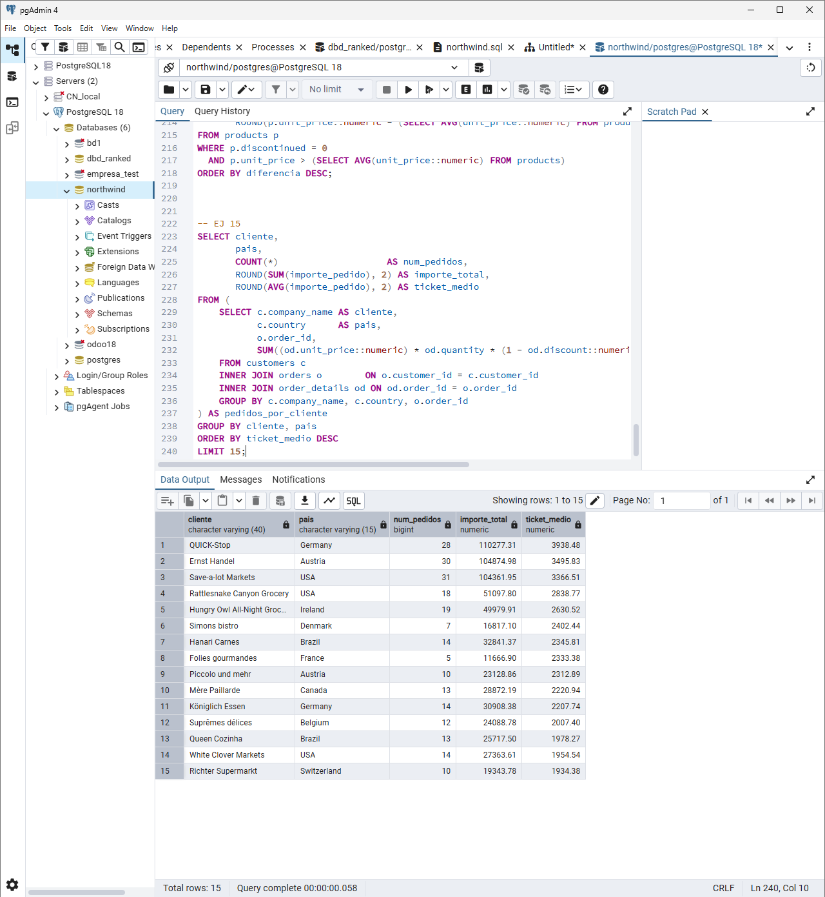

**Comentario:** Aquí lo importante es que primero saco el importe de cada pedido por separado (subconsulta en el FROM) y luego promedio esos importes por cliente, no promedio directamente las líneas. Si promediara las líneas sueltas, un cliente con muchas líneas baratas en un mismo pedido saldría con un ticket medio más bajo del que le corresponde de verdad. Se me olvidó el alias de la subconsulta la primera vez y me dio el típico error de 'subquery in FROM must have an alias'.

---

## Pregunta 16 — El producto más caro de cada categoría

**Enunciado:** Producto con precio más alto de cada categoría (subconsulta correlacionada).

**Consulta:**

```sql
-- EJ 16
SELECT cat.category_name AS categoria,
       p.product_name    AS producto,
       ROUND(p.unit_price::numeric, 2) AS precio,
       ROUND((SELECT AVG(p2.unit_price::numeric)
              FROM products p2
              WHERE p2.category_id = p.category_id), 2) AS precio_medio_categoria
FROM products p
INNER JOIN categories cat ON cat.category_id = p.category_id
WHERE p.unit_price = (
    SELECT MAX(p3.unit_price)
    FROM products p3
    WHERE p3.category_id = p.category_id
)
ORDER BY categoria;
```

**Resultado:**

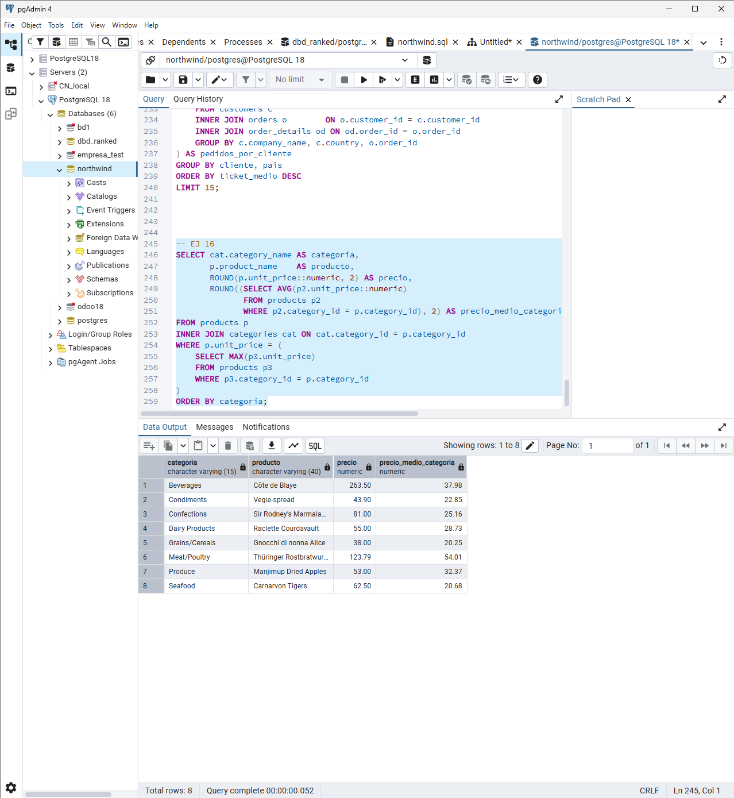

**Comentario:** Uso una subconsulta correlacionada porque para cada producto necesito comparar su precio con el máximo de su propia categoría, y esa comparación cambia según la fila en la que estoy. Entiendo que en una tabla enorme esto sería lento porque en teoría se ejecuta una vez por cada fila de la consulta externa, pero para el tamaño de Northwind no se nota nada.

---

## Pregunta 17 — Segmentación ABC de la cartera de clientes

**Enunciado:** Clientes en cuartiles de facturación (A/B/C/D) con peso sobre el total.

**Consulta:**

```sql
-- EJ 17
WITH facturacion_cliente AS (
    SELECT c.customer_id,
           c.company_name,
           SUM((od.unit_price::numeric) * od.quantity * (1 - od.discount::numeric)) AS facturacion
    FROM customers c
    INNER JOIN orders o        ON o.customer_id = c.customer_id
    INNER JOIN order_details od ON od.order_id = o.order_id
    GROUP BY c.customer_id, c.company_name
),
segmentado AS (
    SELECT *,
           NTILE(4) OVER (ORDER BY facturacion DESC) AS cuartil
    FROM facturacion_cliente
),
etiquetado AS (
    SELECT *,
           CASE cuartil
               WHEN 1 THEN 'A - Estratégico'
               WHEN 2 THEN 'B - Consolidado'
               WHEN 3 THEN 'C - Ocasional'
               WHEN 4 THEN 'D - Marginal'
           END AS segmento
    FROM segmentado
)
SELECT segmento,
       COUNT(*) AS num_clientes,
       ROUND(SUM(facturacion), 2) AS facturacion_segmento,
       ROUND(100 * SUM(facturacion) / (SELECT SUM(facturacion) FROM facturacion_cliente), 2) AS porcentaje_sobre_total
FROM etiquetado
GROUP BY segmento
ORDER BY segmento;
```

**Resultado:**

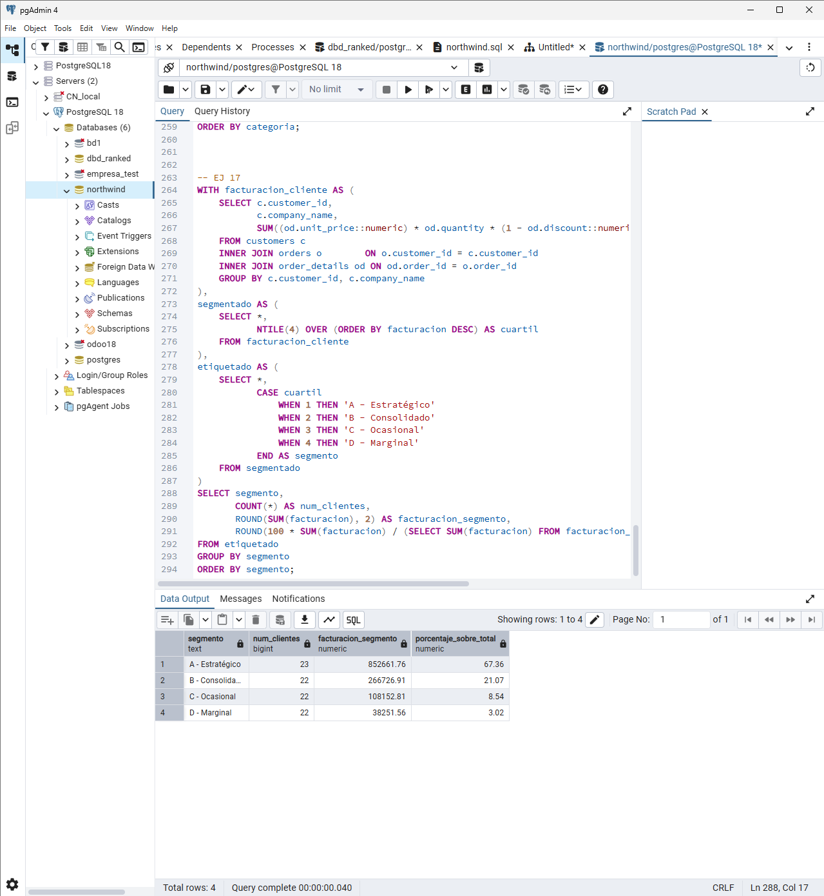

**Comentario:** Usé varias CTE encadenadas porque así puedo ir leyendo la consulta de arriba a abajo como si fueran pasos: primero calculo la facturación por cliente, luego los cuartiles con NTILE, luego les pongo la etiqueta. Si lo hiciera todo con subconsultas anidadas sería un lío para leerlo después.

---

## Pregunta 18 — Los tres productos más vendidos de cada categoría

**Enunciado:** Top 3 por facturación en cada categoría, más posición global.

**Consulta:**

```sql
-- EJ 18
WITH ventas_producto AS (
    SELECT p.category_id,
           cat.category_name,
           p.product_id,
           p.product_name,
           SUM(od.quantity) AS unidades,
           SUM((od.unit_price::numeric) * od.quantity * (1 - od.discount::numeric)) AS facturacion
    FROM products p
    INNER JOIN categories cat  ON cat.category_id = p.category_id
    INNER JOIN order_details od ON od.product_id = p.product_id
    GROUP BY p.category_id, cat.category_name, p.product_id, p.product_name
),
rankeado AS (
    SELECT *,
           RANK() OVER (PARTITION BY category_id ORDER BY facturacion DESC) AS posicion_en_categoria,
           RANK() OVER (ORDER BY facturacion DESC) AS posicion_global
    FROM ventas_producto
)
SELECT category_name AS categoria,
       posicion_en_categoria,
       product_name  AS producto,
       unidades,
       ROUND(facturacion, 2) AS facturacion,
       posicion_global
FROM rankeado
WHERE posicion_en_categoria <= 3
ORDER BY categoria, posicion_en_categoria;
```

**Resultado:**

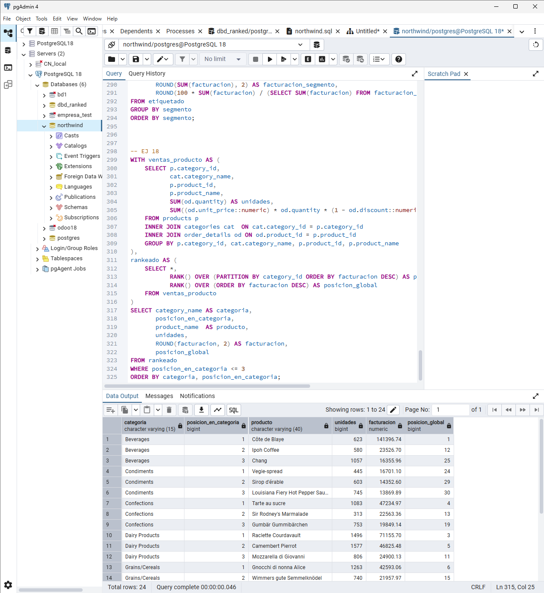

**Comentario:** Para poder filtrar por la posición dentro de la categoría tuve que meter el RANK() en una CTE aparte y filtrar fuera, porque no se puede usar una función de ventana directamente en el WHERE. Usé RANK() y no ROW_NUMBER() porque si dos productos empatan en facturación exacta, quiero que los dos aparezcan con la misma posición, que creo que tiene más sentido que asignarles una posición distinta por casualidad del orden.

---

## Pregunta 19 — Evolución mensual con acumulado y media móvil

**Enunciado:** Facturación mensual de 1997 con acumulado, media móvil 3 meses y variación.

**Consulta:**

```sql
-- EJ 19
WITH ventas_mes AS (
    SELECT DATE_TRUNC('month', o.order_date) AS mes,
           SUM((od.unit_price::numeric) * od.quantity * (1 - od.discount::numeric)) AS facturacion
    FROM orders o
    INNER JOIN order_details od ON od.order_id = o.order_id
    WHERE o.order_date >= '1997-01-01' AND o.order_date < '1998-01-01'
    GROUP BY DATE_TRUNC('month', o.order_date)
)
SELECT mes,
       ROUND(facturacion, 2) AS facturacion,
       ROUND(SUM(facturacion) OVER (ORDER BY mes), 2) AS acumulado,
       ROUND(AVG(facturacion) OVER (ORDER BY mes ROWS BETWEEN 2 PRECEDING AND CURRENT ROW), 2) AS media_movil_3m,
       ROUND(LAG(facturacion) OVER (ORDER BY mes), 2) AS mes_anterior,
       ROUND(100 * (facturacion - LAG(facturacion) OVER (ORDER BY mes))
             / LAG(facturacion) OVER (ORDER BY mes), 2) AS variacion_pct
FROM ventas_mes
ORDER BY mes;
```

**Resultado:**

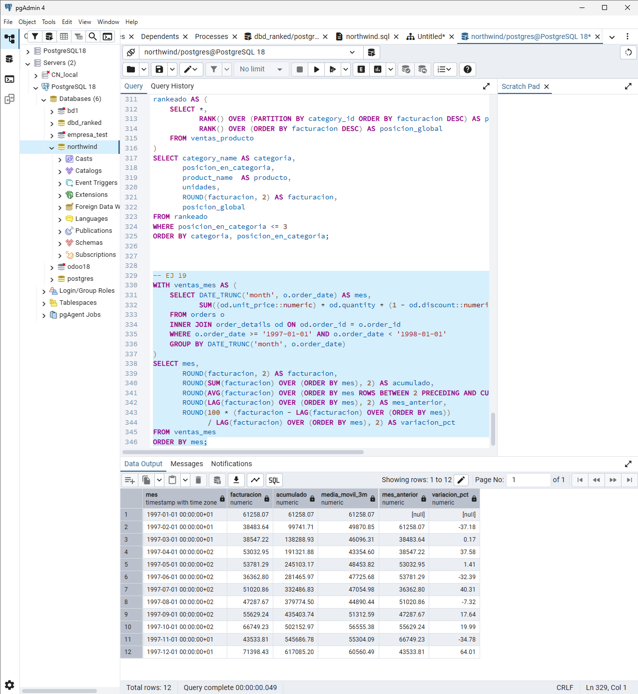

**Comentario:** Para el acumulado no hizo falta definir el marco de la ventana porque PostgreSQL usa por defecto RANGE BETWEEN UNBOUNDED PRECEDING AND CURRENT ROW, que es justo lo que necesito. Para la media móvil sí tuve que poner el ROWS BETWEEN 2 PRECEDING AND CURRENT ROW a mano, si no me devolvía cosas raras. En enero sale NULL en mes_anterior y variacion_pct porque no hay mes de antes, y me pareció mejor dejarlo así que inventarme un 0.

---

## Pregunta 20 — Cuadro de mando anual por categoría

**Enunciado:** Facturación por categoría y año en columnas, con peso y tendencia.

**Consulta:**

```sql
-- EJ 20
WITH ventas AS (
    SELECT cat.category_name AS categoria,
           EXTRACT(YEAR FROM o.order_date)::int AS anio,
           (od.unit_price::numeric) * od.quantity * (1 - od.discount::numeric) AS importe
    FROM categories cat
    INNER JOIN products p       ON p.category_id = cat.category_id
    INNER JOIN order_details od ON od.product_id = p.product_id
    INNER JOIN orders o         ON o.order_id = od.order_id
),
por_categoria AS (
    SELECT categoria,
           ROUND(SUM(importe) FILTER (WHERE anio = 1996), 2) AS f_1996,
           ROUND(SUM(importe) FILTER (WHERE anio = 1997), 2) AS f_1997,
           ROUND(SUM(importe) FILTER (WHERE anio = 1998), 2) AS f_1998,
           ROUND(SUM(importe), 2) AS total
    FROM ventas
    GROUP BY categoria
),
con_total AS (
    SELECT categoria,
           COALESCE(f_1996, 0) AS f_1996,
           COALESCE(f_1997, 0) AS f_1997,
           COALESCE(f_1998, 0) AS f_1998,
           total,
           ROUND(100 * total / SUM(total) OVER (), 2) AS peso_pct,
           CASE
               WHEN f_1998 > f_1997 THEN 'CRECIÓ'
               WHEN f_1998 < f_1997 THEN 'DECRECIÓ'
               ELSE 'IGUAL'
           END AS tendencia,
           FALSE AS es_fila_total
    FROM por_categoria

    UNION ALL

    SELECT 'TOTAL' AS categoria,
           ROUND(SUM(f_1996), 2), ROUND(SUM(f_1997), 2), ROUND(SUM(f_1998), 2),
           ROUND(SUM(total), 2), 100.00, '—',
           TRUE AS es_fila_total
    FROM por_categoria
)
SELECT categoria, f_1996, f_1997, f_1998, total, peso_pct, tendencia
FROM con_total
ORDER BY es_fila_total, total DESC NULLS LAST;
```

**Resultado:**

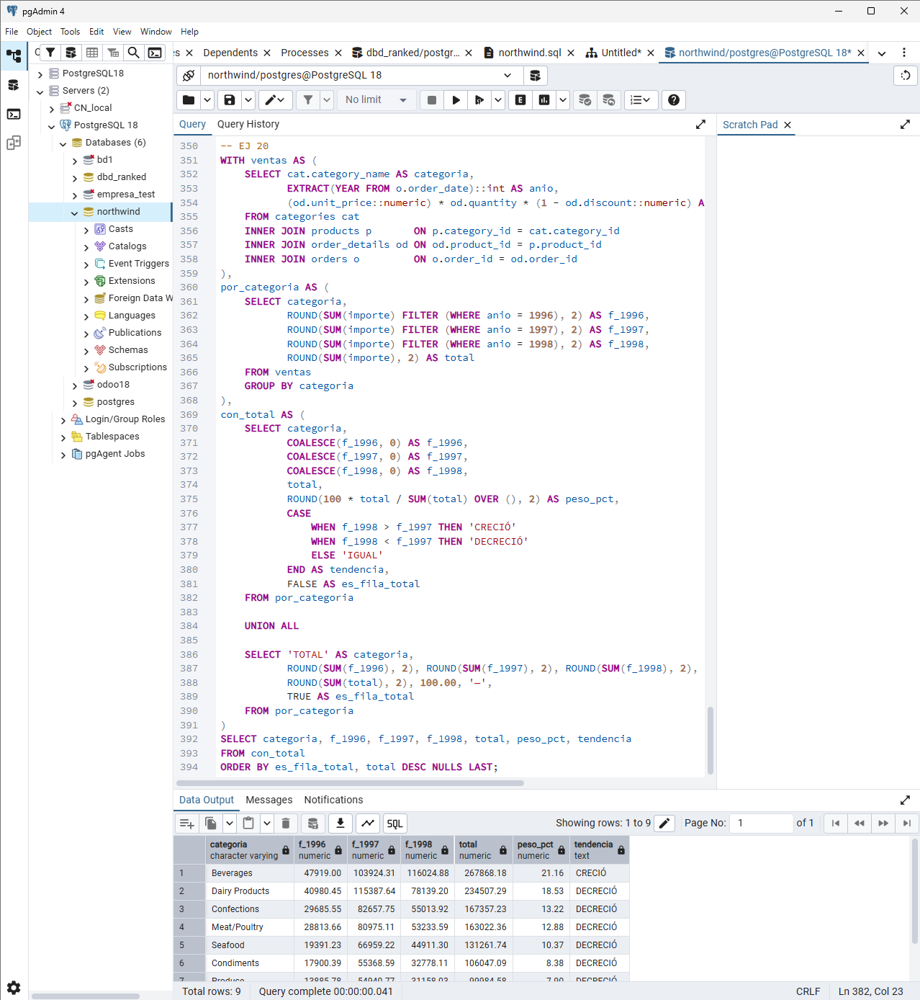

**Comentario:** El pivotado lo hice con FILTER en vez de con CASE WHEN dentro del SUM porque queda mucho más corto y se entiende mejor de un vistazo. Añadí un comentario dentro de la propia consulta explicando que la comparación de tendencia entre 1997 y 1998 no es del todo justa, porque 1996 solo tiene medio año de datos y 1998 solo llega hasta mayo, así que los tres años no son comparables directamente sin normalizar por meses.
